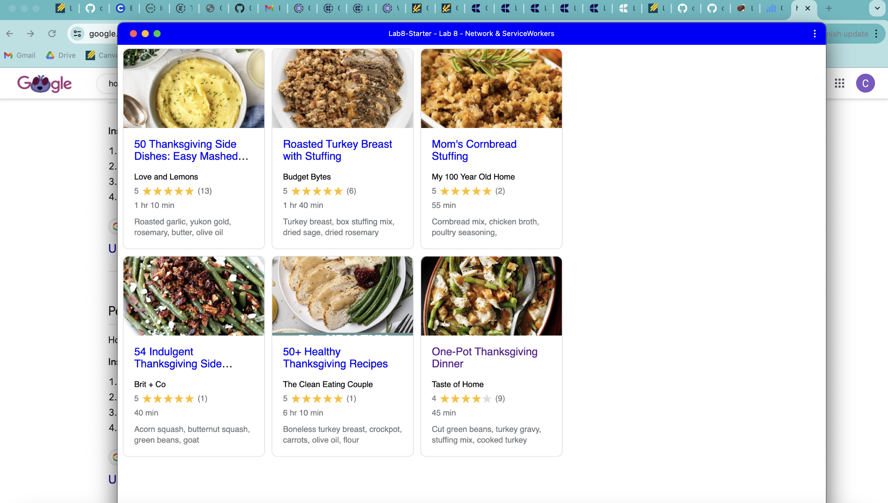

# Lab8-Starter

https://cyavuzucsd.github.io/Lab8-Starter/

Service workers and graceful degredation have a lot of relation. On one hand graceful degradation entails creating a program that will work on the newest hardware while keeping features usable in the event that older devices or browsers become less capable of handling them. Furthermore, service workers allow for features like caching, background synchronisation, and offline capabilities which support the application's fundamental functionality and performance even in the event of bad network circumstances or user offline times. Developers may guarantee that their apps have fallback capabilities to enhance user accessibility, irrespective of the user's connectivity state, by utilising service workers.

